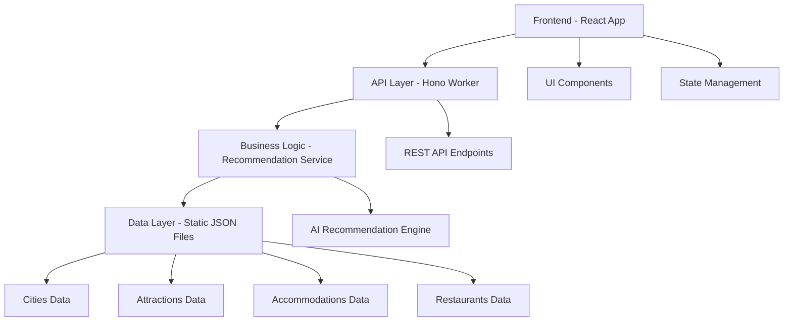
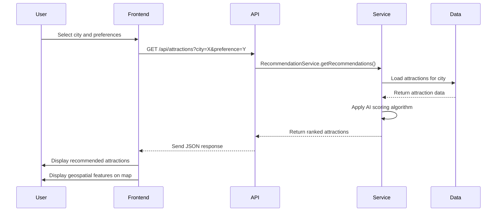
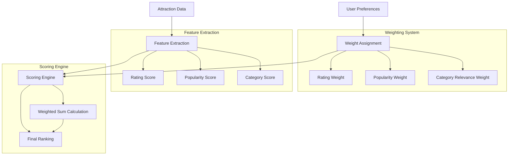

# System Architecture

## High-Level Architecture

```mermaid
graph TD
    A[Frontend - React App] --> B[API Layer - Hono Worker]
    B --> C[Business Logic - Recommendation Service]
    C --> D[Data Layer - Static JSON Files]
    
    A --> E[UI Components]
    A --> F[State Management]
    B --> G[REST API Endpoints]
    C --> H[AI Recommendation Engine]
    D --> I[Cities Data]
    D --> J[Attractions Data]
    D --> K[Accommodations Data]
    D --> L[Restaurants Data]

```

## Data Flow

```mermaid
sequenceDiagram
    participant User
    participant Frontend
    participant API
    participant Service
    participant Data

    User->>Frontend: Select city and preferences
    Frontend->>API: GET /api/attractions?city=X&preference=Y
    API->>Service: RecommendationService.getRecommendations()
    Service->>Data: Load attractions for city
    Data-->>Service: Return attraction data
    Service->>Service: Apply AI scoring algorithm
    Service-->>API: Return ranked attractions
    API-->>Frontend: Send JSON response
    Frontend->>User: Display recommended attractions
    

    Frontend->>User: Display geospatial features on map
```

## AI Recommendation Logic

```mermaid
graph TD
    A[User Preferences] --> B[Weight Assignment]
    C[Attraction Data] --> D[Feature Extraction]
    B --> E[Scoring Engine]
    D --> E
    E --> F[Final Ranking]
    
    subgraph Weighting System
        B --> B1[Rating Weight]
        B --> B2[Popularity Weight]
        B --> B3[Category Relevance Weight]
    end
    
    subgraph Feature Extraction
        D --> D1[Rating Score]
        D --> D2[Popularity Score]
        D --> D3[Category Score]
    end
    
    subgraph Scoring Engine
        E --> E1[Weighted Sum Calculation]
        E1 --> F
    end
```